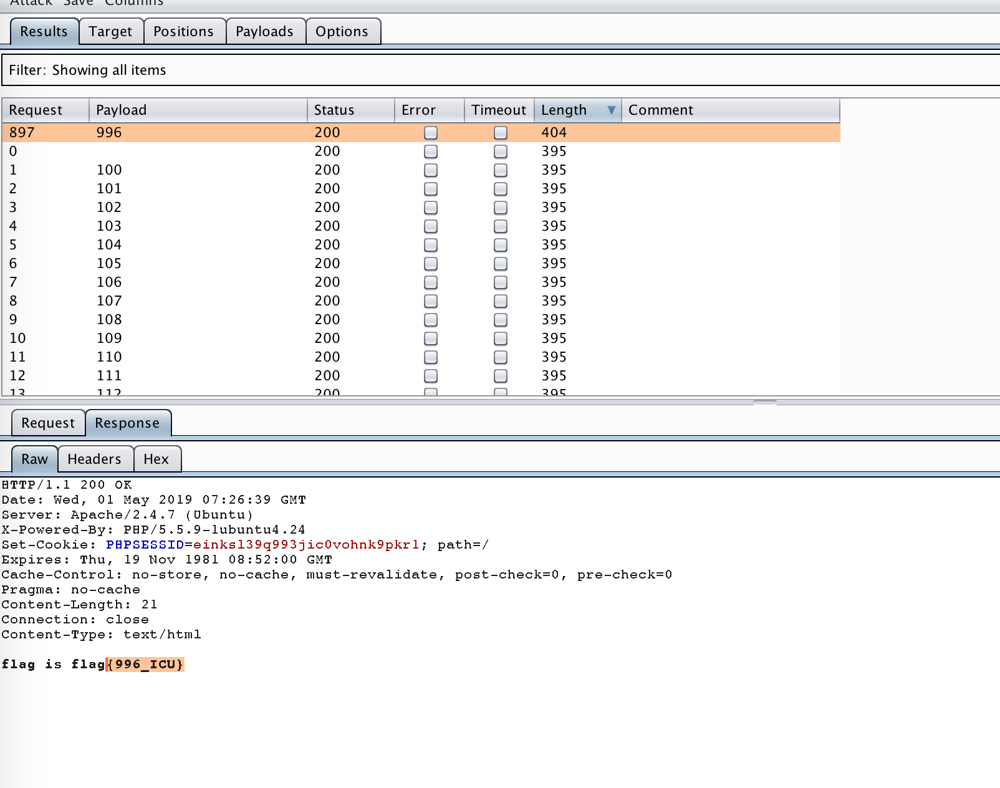

1.隐藏的信息

打开发现为8进制，8进制转ASCII码，然后再base64解密。

2.web2

密码提示三位数字，而且有验证码

抓包把cookie和验证码删了直接爆破




2.web1

源码审计

```
 <?php
error_reporting(0);
require 'flag.php';
$value = $_GET['value'];
$password = $_GET['password'];
$username = '';

for ($i = 0; $i < count($value); ++$i) {
    if ($value[$i] > 32 && $value[$i] < 127) unset($value);
    else $username .= chr($value[$i]);
    if ($username == 'w3lc0me_To_ISCC2019' && intval($password) < 2333 && intval($password + 1) > 2333) {
        echo 'Hello '.$username.'!', '<br>', PHP_EOL;
        echo $flag, '<hr>';
    }
}

highlight_file(__FILE__);
```

value数组中的每个值不能在33~126之间.注意是弱类型比较value=w3lc0me_To_ISCC2019

密码值小于2333且密码值+1大于2333->2332.9

(1)chr函数绕过，

chr函数是根据ascii码返回字符

看下chr函数：

```
<?php
for($i=0;$i<1000;$i++){
    echo chr($i)."</br>";
}
?>
```

发现超过一定范围后又重复了，计算下是超过256就重复，所以可以256+ord()

(2)intval函数

intval函数对于浮点数，直接取整，舍掉小数部分。按照题目要求这个整数必须即小于2333且加了1大于2333。

好像不可能，intval应该没什么问题，加号可能有问题。想到一个浮点数精度问题，浮点数9多了会进位，所以直接232.后面很多9就可以绕过。

poc:web1.py


misc


U2FsdGVkX19QwGkcgD0fTjZxgijRzQOGbCWALh4sRDec2w6xsY/ux53Vuj/AMZBDJ87qyZL5kAf1fmAH4Oe13Iu435bfRBuZgHpnRjTBn5+xsDHONiR3t0+Oa8yG/tOKJMNUauedvMyN4v4QKiFunw==


SaltZWRfX1DAaRyAPR9ONnGCKNHNA4ZsJYAuHixEN5zbDrGxjw==îx53Vuj/AMZBDJ87qyZL5kAf1fmAH4Oe13Iu435bfRBuZgM4BeMGfn7GwMc42JHe3T45rzIb+04okw1Rq5528zI3i/hAqIW6f


